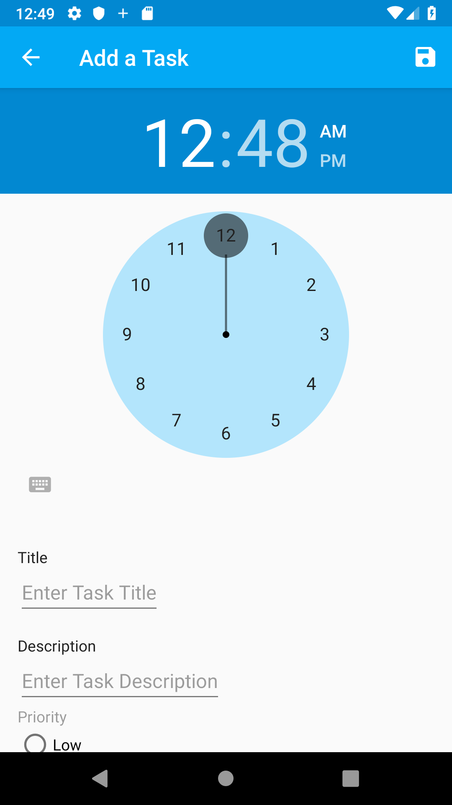
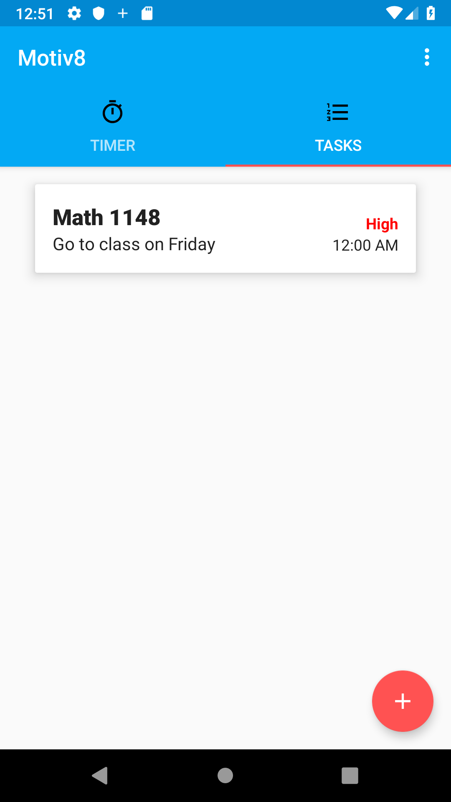
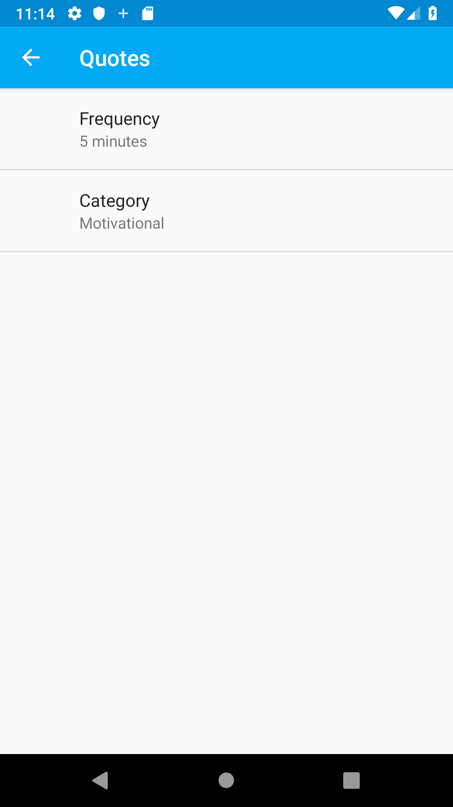
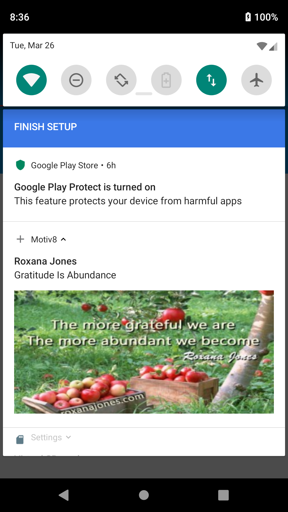
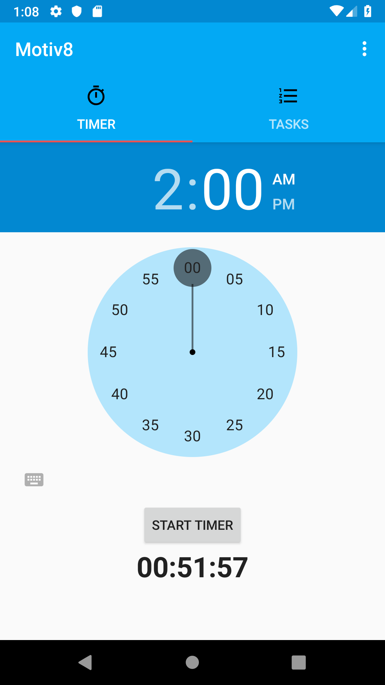

# Motiv8

###
Motiv8 is an application that, you guessed it wants to HELP YOU GET MOTIVATED through periodically giving you inspirational quotes to keep you on track! Keep track of your tasks using the built-in task's list

## Overview
Motiv8 utilizes multiple Activites, Services, Broadcast Receivers, Content Providers (Room), and the MVVM(Model-View-ViewModel) architecture pattern

## Structure

#### Activities

<ol>
    <li>Main Activity</li>
    <ol>
        <li>Timer Fragment</li>
        <li>Task Fragment</li>
    </ol>
    <li>Settings Activity</li>
    <li>Add Task Activity</li>
</ol>

#### Services
<ol>
    <li>MyTaskService (Service)</li>
    <li>MyAlarmReceiver (Broadcast Receiver)</li>
</ol>

#### Other Components/Libraries
<ol>
    <li>Room (Content Provider)</li>
    <li>Retrofit</li>
    <li>Picasso</li>
    <li>Butterknife</li>
<ol>

#### Adding a Task

Users can Navigate to the Tasks Tab and Create a new Task using the Floating Action Button. Once save is clicked, the Task is saved locally to Sqlite Database. This database is then used to populate the Task Fragment when there are items within.

<figure class ="image">
    
    <figcaption style="text-align:center">Adding a Task</figcaption>
</figure>

<h4 style="color:red;text-align:center"> *A title, description, and priority is required for every task.</h4>

<figure class ="image">
    
    <figcaption style="text-align:center">Viewing Your Tasks</figcaption>
</figure>

#### Settings
The Settings Activity allows users to change their preferences on their desired type of quote, as well as quote frequency. The Retrofit API call is based on the category value, while the AlarmReceiver frequency is set by the quote frequency.

<figure class ="image">
    
    <figcaption style="text-align:center">Quote Settings</figcaption>
</figure>

<figure class ="image">
    
    <figcaption style="text-align:center">An Example of a Quote Notification</figcaption>
</figure>

### Timer
Once the Start Timer Button is hit, the counter will begin to count down. Use this screen to time yourself, or just turn it on to get quotes of your chosen category for a certain time.
<figure class ="image">
    
    <figcaption style="text-align:center">The Time Counting Down</figcaption>
</figure>

#### Services
The Service and Broadcast Receiver are used in conjunction with each other to provide the user with quotes at their desired frequency. Once the "Start Timer" button has been hit, The Service is then started. This service then starts the Broadcast Receiver. The Broadcast Receiver is responsible for pushing notifications.

### The inspiration for this project is mostly due to my own journey of trying to achieve better time management skills as well as keeping myself motivated. I believe anyone is capable of doing what they want, they just need that extra pat on the back :). Enjoy, feedback is welcomed!

#### TODO